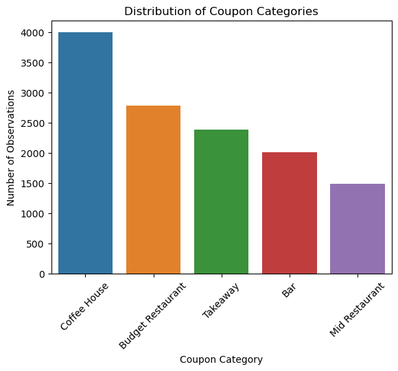
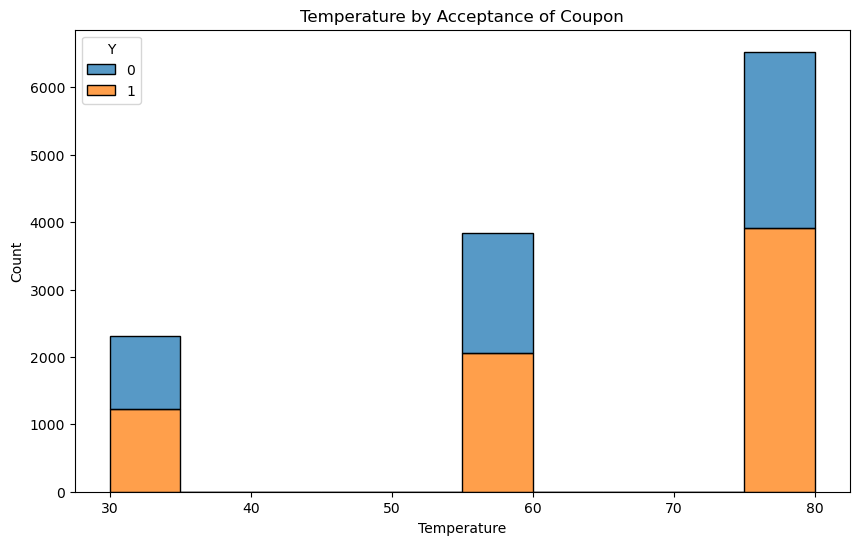
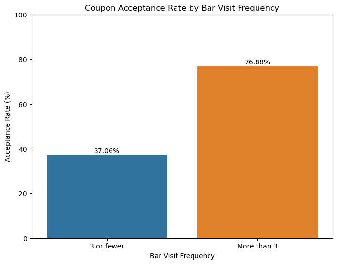
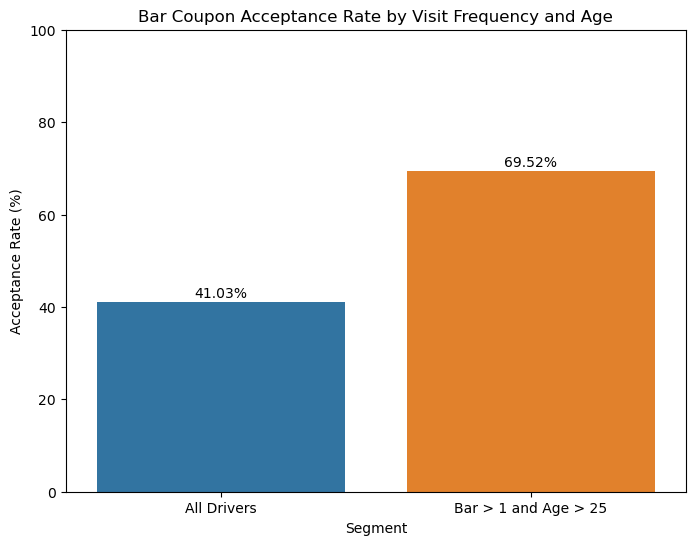
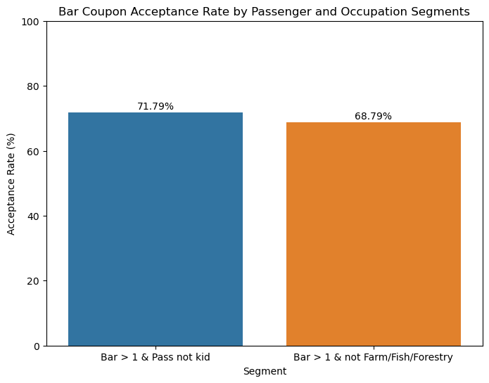
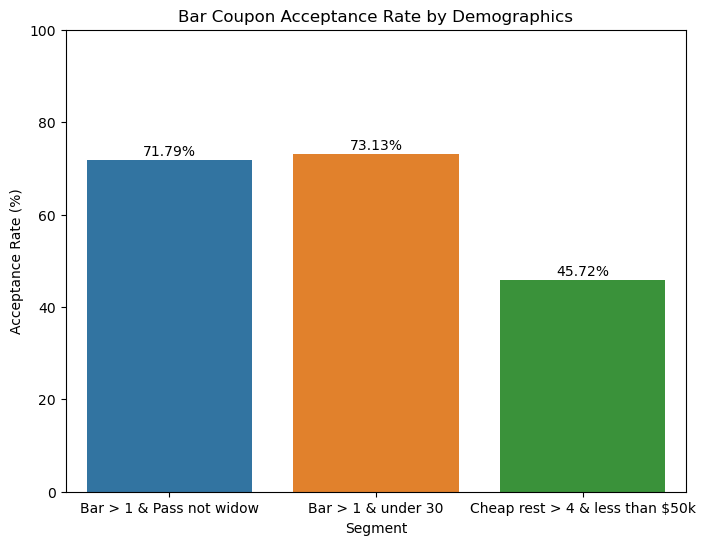
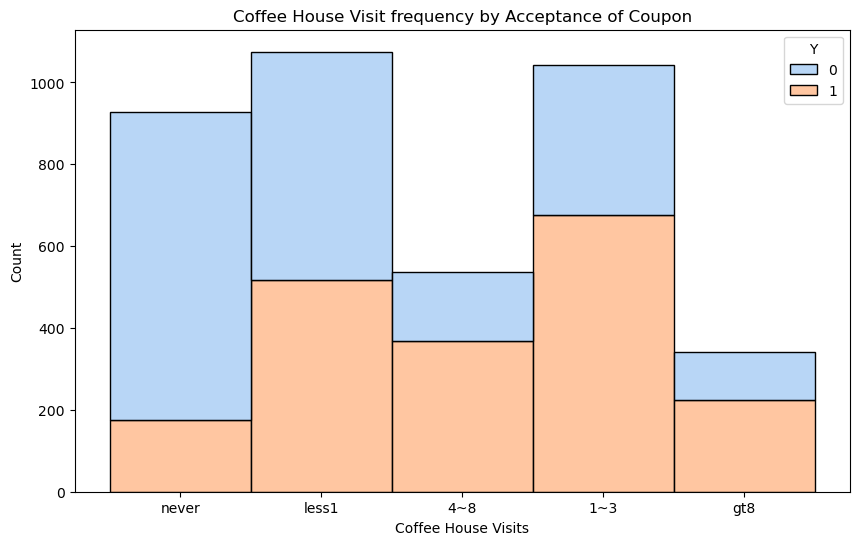
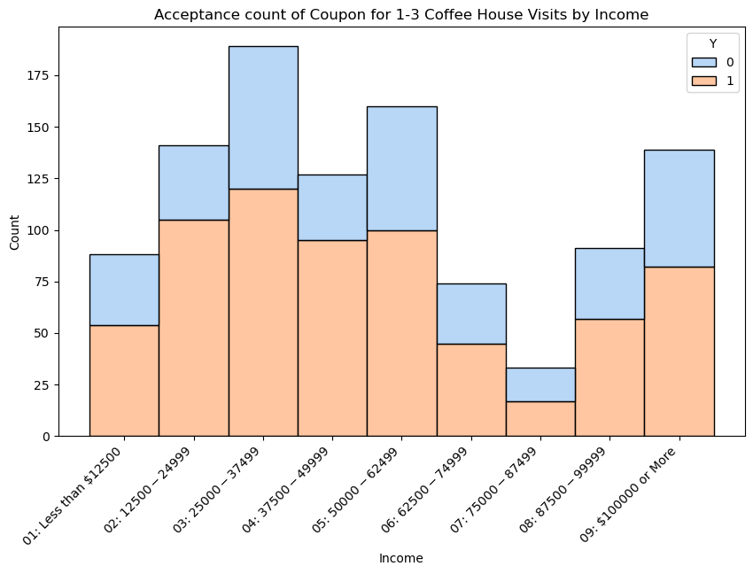
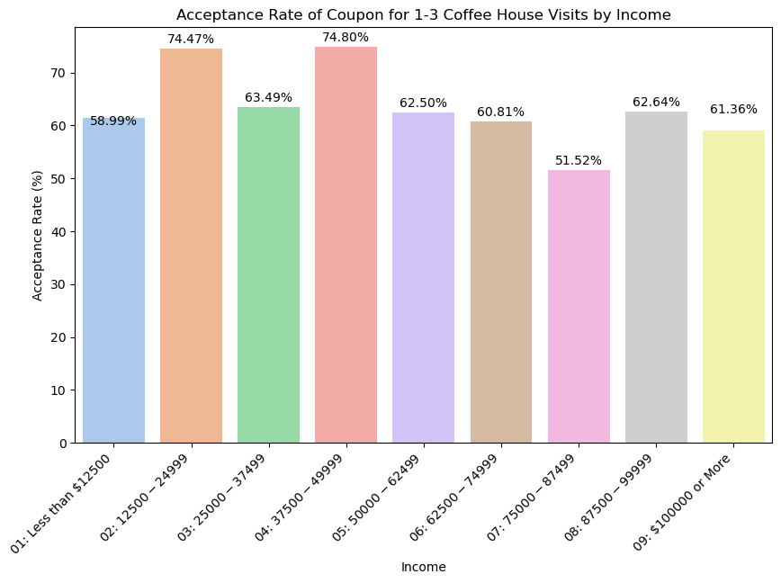
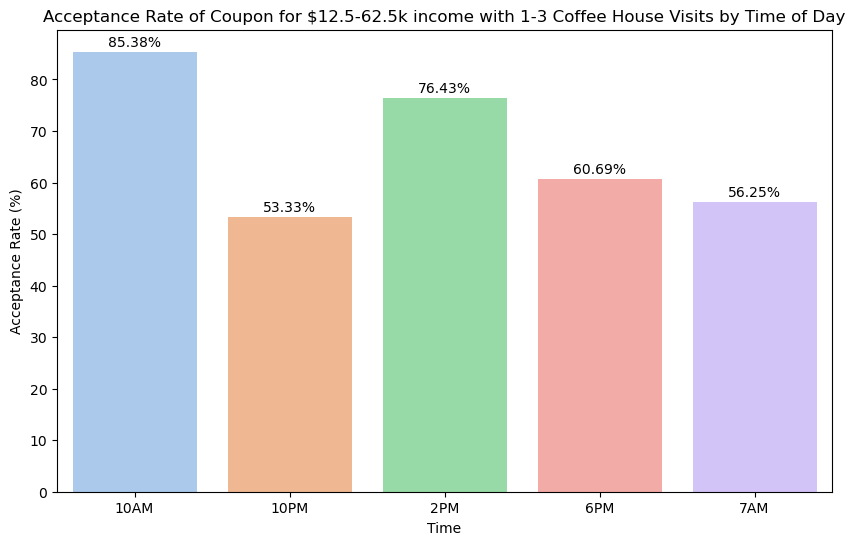

# Coupon Acceptance Data Analysis Overview

First of all I examined the dataset `coupons.csv` to identify missing or problematic data and conducted initial visualizations to understand the distribution of the data and key metrics. Below is a detailed overview of the steps taken and the findings, along with references to the visualizations created.

---

## Investigating Missing Data

**Initial Data Inspection**:
I started by loading the dataset and inspecting the first few rows and the overall structure of the data.

**Identifying Missing Values**:
I identified columns with missing values. Key observations included:
- The `car` column had 12,576 missing values.
- Columns like `Bar`, `CoffeeHouse`, `CarryAway`, `RestaurantLessThan20`, and `Restaurant20To50` had fewer missing values.

**Handling Missing Data**:
Given the high number of missing values in the `car` column, I decided to drop this column entirely. This reduced the dataset to 25 columns.

---

## Proportion of Coupon Acceptance

I calculated the proportion of total observations that chose to accept the coupon using the `Y` column.

**Finding**:
- **56.84%** of the total observations accepted the coupon.

---

## Visualizing Coupon Distribution

I visualized the distribution of coupon categories using a bar plot. First, I renamed the columns for ease of readability and then plotted the distribution.

**Observation**:
- The most frequent coupon category was `Coffee House` with 3,996 observations, followed by `Budget Restaurant` with 2,786 observations.

---

## Visualizing Temperature Distribution

I used a histogram to visualize the distribution of the `temperature` column and how it relates to coupon acceptance (`Y`).

**Observation**:
- The dataset showed three distinct temperature values: 80, 55, and 30 degrees.
- The majority of the data points were at 80 degrees, with a significant number of observations accepting the coupon.

# Investigating the Bar Coupons

This section is an in-depth analysis focusing exclusively on bar-related coupons. The goal was to uncover patterns in coupon acceptance rates among different segments of drivers. Below is a detailed overview of the findings and visualizations.

I started by creating a new DataFrame that contains only the bar coupons.
- **41.00%** of participants accepted the bar coupon.

---

## Comparison by Bar Visit Frequency

I compared the acceptance rate between drivers who visited a bar 3 or fewer times a month and those who visited more frequently.

**Observation**:
- Drivers who visited a bar more than 3 times a month had a higher acceptance rate compared to those who visited 3 or fewer times.

---

## Comparison by Age

We compared the acceptance rate between drivers who visited bars more than once a month and were over the age of 25 to all other drivers. This helps identify if age influences coupon acceptance when combined with bar visit frequency.

**Observation**:
- Drivers over the age of 25 who visited bars more than once a month had a higher acceptance rate compared to the overall acceptance rate.

---

## Comparison by Passenger and Occupation

We compared the acceptance rate between drivers who:
- Went to bars more than once a month and had passengers that were not kids.
- Had occupations other than farming, fishing, or forestry.

**Observation**:
- Drivers who had passengers that were not kids and went to bars more than once a month had a higher acceptance rate.
- Drivers with occupations other than farming, fishing, or forestry also had higher acceptance rates.

---

## Comparison by Demographic Segments

We further compared the acceptance rates between different demographic segments:
- Drivers who went to bars more than once a month, had passengers that were not kids, and were not widowed.
- Drivers who went to bars more than once a month and were under the age of 30.
- Drivers who went to cheap restaurants more than 4 times a month and had an income of less than 50K.

**Observation**:
- Drivers who went to bars more than once a month, had passengers that were not kids, and were not widowed had a high acceptance rate of 71.79%.
- Drivers under the age of 30 who went to bars more than once a month had an acceptance rate of 73.13%.
- Drivers who went to cheap restaurants more than 4 times a month and had an income of less than 50K had a lower acceptance rate of 45.72%.

---

## Hypotheses Based on Observations

From these observations, we hypothesize that:
- **Frequency of Bar Visits**: The most significant factor influencing the acceptance of bar coupons is the frequency of bar visits. Drivers who visit bars more than once a month show much higher acceptance rates.
- **Demographics**: Age and income also play roles. Younger drivers and those with specific income levels have varying acceptance rates.
- **Passenger and Occupation**: The type of passengers and occupation also affect coupon acceptance rates, with non-kid passengers and non-farming/fishing/forestry occupations showing higher acceptance.

# Independent Investigation: Coffee House Coupons

In this section, we explored the acceptance rates of coffee house coupons to determine the characteristics of passengers who accept these coupons. We analyzed various segments to uncover patterns and insights.

I started by creating a new DataFrame that contains only the coffee house coupons. I then cleaned the data by removing rows with missing values in the CoffeeHouse column. This ensures that our analysis is based on complete data without any gaps that could skew the results.

---

## Acceptance Rate Based on Coffee House Visits

I analyzed the acceptance rate of coffee house coupons based on the number of visits to coffee houses. A histogram was used to visualize the frequency of coffee house visits and the corresponding coupon acceptance rates. This approach helps identify if the frequency of visits influences coupon acceptance.

**Observation**:
- The histogram shows the distribution of coffee house visits and the corresponding coupon acceptance rates.

---

## Acceptance Rate by Income for 1-3 Coffee House Visits

I filtered the data to include only those who visit coffee houses 1-3 times and analyzed the acceptance rate by income category. This helps to understand how income levels affect coupon acceptance.

- I created a mapping for the income categories to ensure they are categorized properly on the chart.
- The acceptance rate by income was then plotted.

**Observation**:
- The raw count of coupon acceptance shows that certain income categories have higher acceptance rates.

**Observation**:
- The bar plot shows the acceptance rate percentage by income category for those who visit coffee houses 1-3 times.

---

## Acceptance Rate by Time of Day for Specific Income Brackets

I isolated the data for coffee house visits 1-3 times and income brackets from $12.5K to $62.5K, the income tiers with the highest acceptance counts and therefore the least chance of skew, to calculate the acceptance rate by the time of day. This shows how the time of day affects coupon acceptance for specific income brackets.

**Observation**:
- The bar plot shows that the highest acceptance rate was at 10 AM (85%), followed by 2 PM (76%).

---

### Hypotheses Based on Observations

From these observations, we hypothesize that:
- **Frequency of Coffee House Visits**: Passengers who visit coffee houses 1-3 times are more likely to accept the coupon.
- **Income**: Income brackets from $12.5K to $62.5K are more likely to accept the coupon.
- **Time of Day**: The time of day significantly affects coupon acceptance rates, with peak acceptance at 10 AM and 2 PM.

These findings provide a detailed understanding of the factors influencing coffee house coupon acceptance, which can guide targeted marketing strategies.
